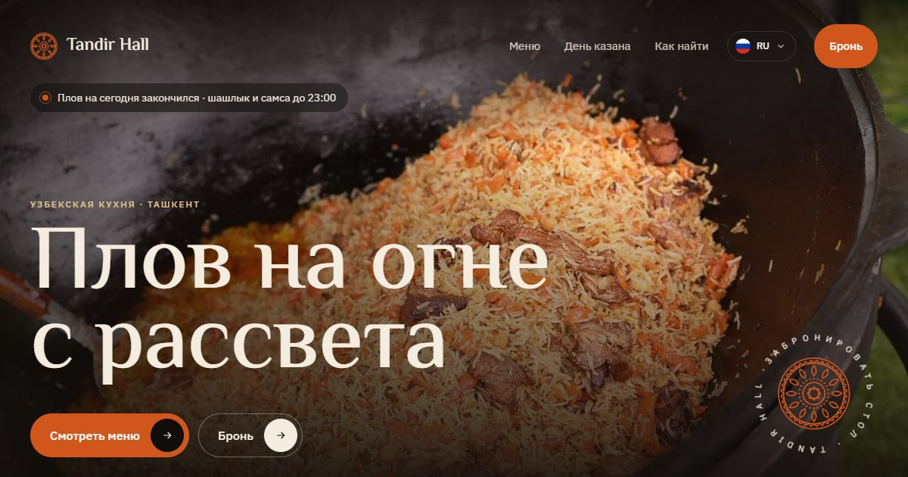

# Tandir Hall: restaurant site with QR menu



**Live:** https://tandir-demo.pages.dev

Demo site for a fictional Uzbek restaurant in Tashkent: a website plus the system behind it. Dishes, prices and reviews are illustrative.

## Features

- Five languages with their own URLs, including Arabic laid out right to left
- `/menu/?t=7`: QR menu for a table, with cart, waiter and bill buttons; the kitchen always receives the order in one language, whatever the guest used
- `/tables/`: print-ready table cards, one QR code per table
- Table booking that ends in a stamped invitation with a QR code, saved as an image or added to the calendar
- Live "kazan status" in the hero (plov served 12:00–15:00 Tashkent time)
- Bread-stamp ornament generated in code, used as the loader and logo

## Stack

Astro · TypeScript · Tailwind CSS · GSAP · Lenis · Cloudflare Pages

Every page passes an automated layout audit (Puppeteer) at five screen widths and in every language before deploy.

## Run

```bash
npm install
npm run dev
npm run build
```

Made by [Sabir Hussein](https://sabr-studio.pages.dev).
